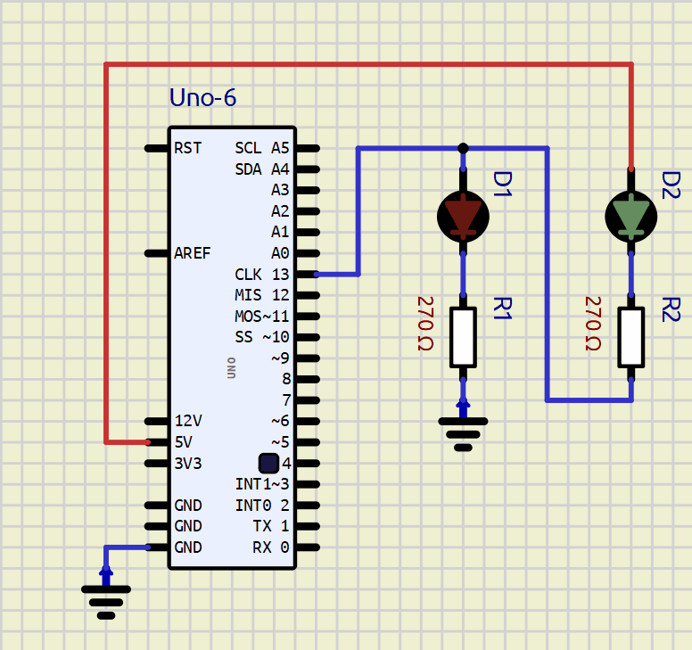

# Lab 1: Christopher Koiš

### PARIS morse code experiment

1. SimulIDE simulation

   

```c
/***********************************************************************
 * 
 * Blink a LED in Arduino-style and use function from the delay library.
 * ATmega328P (Arduino Uno), 16 MHz, PlatformIO
 *
 * Copyright (c) 2022 Tomas Fryza
 * Dept. of Radio Electronics, Brno University of Technology, Czechia
 * This work is licensed under the terms of the MIT license.
 * 
 **********************************************************************/


/* Defines -----------------------------------------------------------*/
#define LED_GREEN PB5   // PB5 is AVR pin where green on-board LED 
                        // is connected           
//#define SHORT_DELAY 60 // Delay in milliseconds. 60 dits/(50*20 wpm) = 0.06s per dit
#define SHORT_DELAY 180
#ifndef F_CPU
# define F_CPU 16000000 // CPU frequency in Hz required for delay funcs
#endif

/* Includes ----------------------------------------------------------*/
#include <avr/io.h>     // AVR device-specific IO definitions
#include <util/delay.h> // Functions for busy-wait delay loops


// -----
// This part is needed to use Arduino functions but also physical pin
// names. We are using Arduino-style just to simplify the first lab.
#include "Arduino.h"
#define PB5 13          // In Arduino world, PB5 is called "13"
// -----


/* Function definitions ----------------------------------------------*/
/**********************************************************************
 * Function: Main function where the program execution begins
 * Purpose:  Toggle one LED and use delay library.
 * Returns:  none
 **********************************************************************/
void dit(void){
    
    digitalWrite(LED_GREEN, HIGH);
    _delay_ms(SHORT_DELAY);
    digitalWrite(LED_GREEN, LOW);
    _delay_ms(SHORT_DELAY);

}

void dah(void){

    digitalWrite(LED_GREEN, HIGH);
    _delay_ms(3*SHORT_DELAY);
    digitalWrite(LED_GREEN, LOW);
    _delay_ms(SHORT_DELAY);

}

void charSpace(void){
    
    _delay_ms(3*SHORT_DELAY);
  
}

void wordSpace(void){
    
    _delay_ms(7*SHORT_DELAY);
  
}

int main(void)
{
    // Set pin where on-board LED is connected as output
    pinMode(LED_GREEN, OUTPUT);

    // Reset LED
    digitalWrite(LED_GREEN, LOW);

    //Input string
    char morse[] = ".--. .- .-. .. .../";

    // Infinite loop
    while (1)
    {
        // Pause several milliseconds
        _delay_ms(SHORT_DELAY);

        for(int i = 0; i < (sizeof(morse) - 1); i++)
        {
  		
            if(morse[i] == '.')
            {
                dit();
            }
        
            else if(morse[i] == '-')
            {
                dah();
            }
            
            else if(morse[i] == ' ')
            {
                charSpace();
            }
            
            else
            {
                wordSpace();
            }
  	    }
    }

    // Will never reach this
    return 0;
}

```